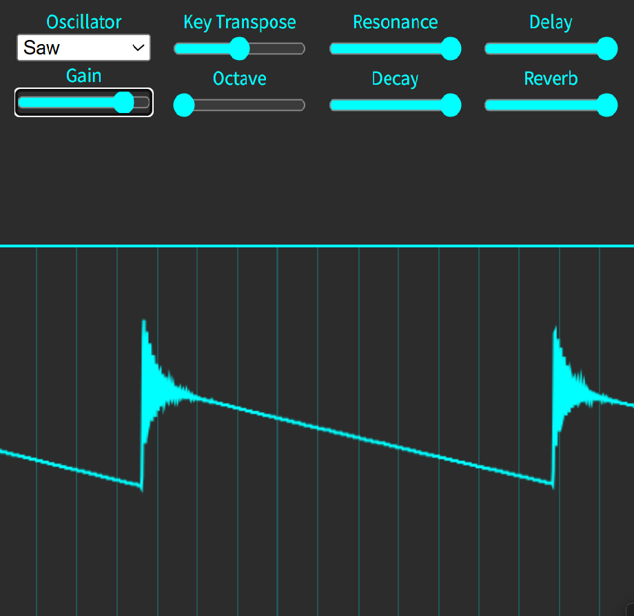

# XY-Synth
by Dr.Maruzilla

  Demo https://maruzilla.github.io/XY-Synth/

# An interactive analog synth emulator for smartphones (For live performances only).

Simply swipe the rectangular area horizontally to play the specified scale.

Vertical swipes change the cutoff frequency.

The waveform is displayed in real time within the rectangle.

If you're interested in JavaScript programming and the WebAudio API, Enjoy hacking!
